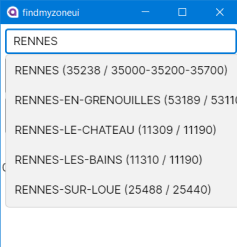
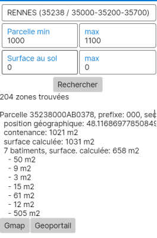

# FindMyZone

Outil de recherche de parcelles.

Au premier lancement, l'outil télécharge (dans le dossier Documents\findmyzone) le fichier des correspondances ville <> code postal <> code INSEE,
depuis data.gouv.fr.

Ensuite, commencez à taper la ville souhaitée, des propositions seront affichées :

Indiquez ensuite la taille minimale et/ou maximale des parcelles recherchées,
et éventuellement une surface au sol de bâtiments :

La liste de résultats s'affiche,
cliquez sur le bouton Gmaps, votre navigateur web s'ouvre à la position de la parcelle sur google maps.
De même, le bouton geoportail vous enverra à l'emplacement de la parcelle sur geoportail.gouv.fr.
